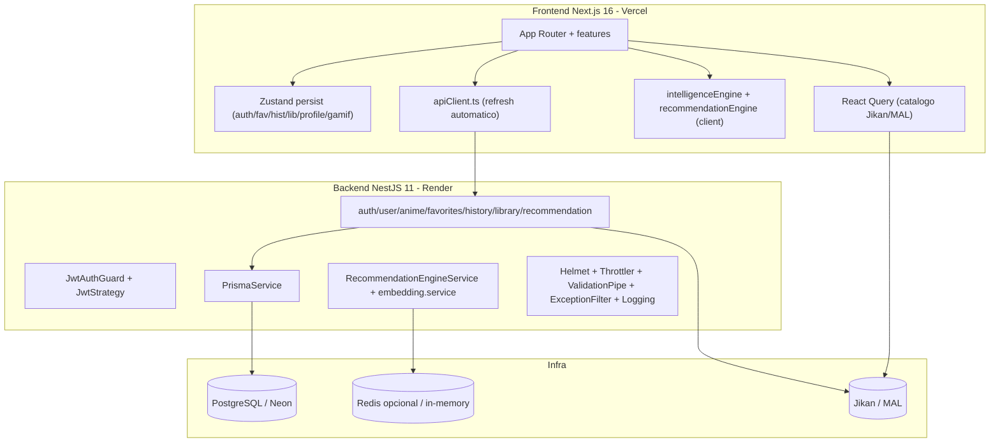
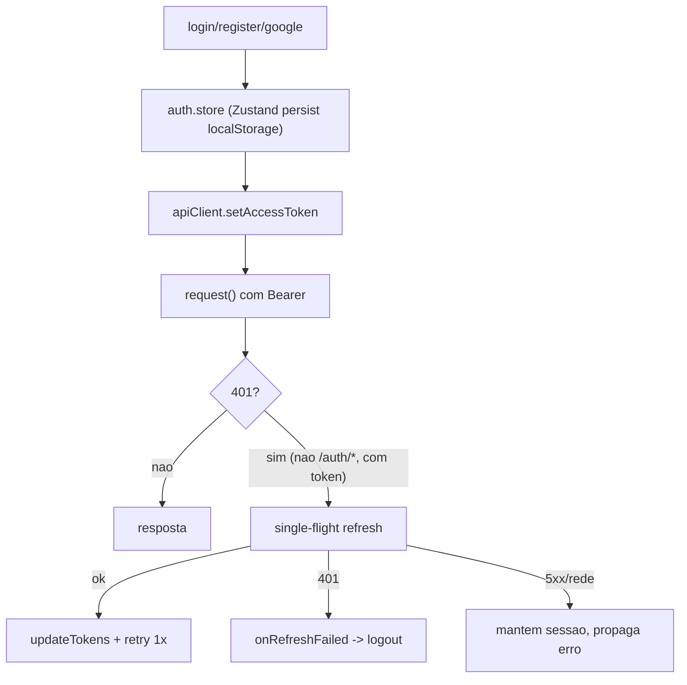

# AnimeVerse — Checkpoint Técnico (até FASE 2.2-B)

Documento de onboarding para um novo engenheiro assumir o projeto. Cobre arquitetura, fases concluídas, segurança, banco, recommendation engine, auditoria, plano aprovado, decisões e riscos.

> Última atualização: conclusão do planejamento da FASE 2.2-B (sem implementação de código do motor unificado ainda).

---

## 1. Visão geral do produto

AnimeVerse é uma plataforma premium de descoberta de animes. Monorepo informal com **frontend Next.js** na raiz e **backend NestJS** em `server/`. Dados de catálogo vêm de MAL/Jikan; a camada de inteligência (recomendações) é própria.

- **Deploy alvo:** Vercel (frontend) + Render (backend) + PostgreSQL gerenciado (atualmente **Neon**).
- **Estado:** MVP funcional evoluindo para produção; fases de hardening e unificação de recomendação em andamento.

---

## 2. Arquitetura atual

### Stack

| Camada | Tecnologias |
|--------|-------------|
| Frontend | Next.js 16 (App Router), React 19, TypeScript, Tailwind v4, Zustand (persist), TanStack React Query, Framer Motion, hls.js |
| Backend | NestJS 11, Prisma 6, Passport JWT, Zod, bcryptjs, google-auth-library, ioredis, helmet, @nestjs/throttler, class-validator/transformer |
| Banco/Cache | PostgreSQL (Neon), Redis opcional (fallback in-memory) |
| Dados externos | Jikan v4 (MAL); MAL oficial opcional via `NEXT_PUBLIC_MAL_CLIENT_ID` |

### Estrutura de pastas (essencial)

- Frontend `src/`: `app/` (rotas), `features/` (anime, auth, explore, gamification, profile, recommendations), `services/` (apiClient, animeService, intelligenceEngine, recommendationEngine, syncService), `store/` (Zustand), `domain/`, `hooks/`, `utils/`.
- Backend `server/src/`: `modules/` (auth, user, anime, favorites, history, library, recommendation), `common/` (guards, pipes, decorators, cache, filters, interceptors, utils), `services/` (jikan, embedding, recommendation), `prisma/`.

---

## 3. Fases concluídas

| Fase | Entrega | Estado |
|------|---------|--------|
| **0** | `.env.example` (raiz + server), documentação de ambiente, correção de `.gitignore` | Concluída |
| **1.1** | Correção de IDOR em `GET /recommendations/:userId` (valida `@CurrentUser().id` vs `:userId`, `ForbiddenException`) | Concluída |
| **1.2** | Refresh automático de JWT no `apiClient` (single-flight + retry único em 401) + `updateTokens` no auth.store + testes | Concluída |
| **1.3** | Hardening backend: Helmet, Rate limit (Throttler), ValidationPipe global, Exception Filter global, logs estruturados com redação | Concluída |
| **2.1** | Data model + contratos: modelo `UserRating`, tipagem de `reasons` (`recommendation.dto.ts`), `reasons?` opcional no `AnimeSummaryDto`, migration aplicada | Concluída |
| **2.2-A** | Auditoria da recommendation engine (mapeamento completo dos motores) | Concluída |
| **2.2-B** | Planejamento do motor único (plano aprovado, sem código) | Concluída |

---

## 4. Segurança implementada (FASE 1.3)

Tudo global, aplicado em `server/src/app.module.ts` e `server/src/main.ts`:

- **Helmet** — CSP, `X-Content-Type-Options`, `X-Frame-Options`; `crossOriginResourcePolicy: cross-origin` para compatibilizar com CORS.
- **Rate limit (`@nestjs/throttler`)** — global 200 req/min; rotas de auth (login/register/google) **10 req/min por IP** (`@Throttle`); `/health` com `@SkipThrottle`.
- **ValidationPipe global** — `whitelist`, `forbidNonWhitelisted`, `transform` (Zod continua sendo a validação principal por rota).
- **Exception Filter global** (`server/src/common/filters/http-exception.filter.ts`) — todas as respostas de erro no contrato `{ message, statusCode }`; erros 500 não vazam detalhes; `ThrottlerException` → 429.
- **Logs estruturados** — `LoggingInterceptor` (requests) + eventos `auth_*`; `sanitizeForLog` redige `password`, `refreshToken`, `accessToken`, `authorization`, etc.

O contrato de erro `{ message, statusCode }` é **invariante** — o `apiClient` do frontend depende dele.

---

## 5. Autenticação

- **Access token JWT** (`JWT_ACCESS_SECRET`, TTL default 900s) + **refresh token opaco** (48 bytes hex, persistido em `refresh_tokens`, com rotação no refresh).
- **Backend:** Passport JWT (`JwtStrategy` valida usuário no banco), `JwtAuthGuard`, `@CurrentUser()` expõe `{ id, email, name }` (contrato invariante). Google OAuth via `google-auth-library`. Senhas com bcrypt cost 12.
- **Frontend:** tokens em LocalStorage (Zustand persist); refresh automático no `apiClient` com **single-flight** (uma promise compartilhada) e **retry único**; `updateTokens` preserva `user`/`isAuthenticated` (pois `/auth/refresh` retorna só `TokenPair`).
- **Sincronização:** `syncService` empurra favoritos/histórico/biblioteca no login e em ações; só ids numéricos (MAL) são sincronizados.

---

## 6. Banco de dados (Prisma / PostgreSQL)

Schema em `server/prisma/schema.prisma`. Migrations:

1. `20260705213528_init`
2. `20260705234000_oauth`
3. `20260706210000_library`
4. `20260708123912_add_user_rating` (FASE 2.1)

| Modelo | Papel | Notas |
|--------|-------|-------|
| `User` | Conta + perfil | provider local/google, `oauthId` |
| `RefreshToken` | Rotação de refresh | cascade |
| `UserPreferences` | `preferredGenres`, `genreScores` (Json), `totalWatchTime` | sinal de gosto |
| `Anime` | Cache de metadados MAL | upsert em view/favorite |
| `Favorite` | user↔anime (binário) | unique(userId, animeId) |
| `WatchHistory` | Progresso por episódio | `progress`, `duration` |
| `LibraryEntry` | Listas watching/completed/planned | |
| `UserRating` | **Nova (2.1)** nota 1–10 | unique(userId, animeId); **sem UI/endpoint ainda** |
| `RecommendationCache` | Reco computada | `animeIds[]`, `meta` (Json), `expiresAt` |

Pontos de atenção:

- O banco em uso é **Neon (nuvem)**, não o Postgres do `docker-compose` local.
- `prisma/seed.ts` é referenciado no `package.json` mas **não existe**.

---

## 7. Recommendation Engine — estado atual

Existem **três motores** com fórmulas divergentes; a UI usa os do frontend e **não consome** o endpoint backend.

| Local | Papel | Fórmula |
|-------|-------|---------|
| `src/services/recommendationEngine.ts` | **Motor principal da UI** | `emb*0.35 + taste*0.3 + quality*0.2 + pop*0.1 + interaction*0.05` |
| `src/services/intelligenceEngine.ts` | Utilitários content-based (similar, filtros, collections, `animeVerseScore`) | `normalizedAffinity*2 + quality` |
| `server/src/services/embedding.service.ts` | **Motor real do backend** | `emb*0.55 + quality*0.3 + pop*0.15` |
| `server/src/services/recommendation.service.ts` | **Código morto** (`scoreAnime`/`recommend`/`animeVerseScore`); só `buildTasteProfile` é usado | — |

- **Perfil de gosto:** preferido +5, favorito +3, histórico/view +1 (alinhado front/back).
- **Consumidores:** Home (`RecommendedRow`, `TasteBasedRow`, `HiddenGemsRow`, `useSmartFeeds`), Explore (`RecommendedRow`, `useDiscoveryCollections`), Perfil (`useRecommended`). Biblioteca **não** usa recomendação.
- `src/utils/embeddings.ts` (frontend) é espelho de `embedding.service.ts` (duplicação).

---

## 8. Auditoria 2.2-A (resumo)

**Dados reais hoje:** histórico OK, favoritos OK, gêneros OK, tendências OK (Jikan), **usuários similares ausente** (sem cross-user), **ratings parcial** (só schema, sem dados/UI).

**Aproveitável:** `buildTasteProfile`, `embedding.service.ts` (canônico), `RecommendationEngineService` + cache, `toResponse`/`fromDb`, contrato `reasons` (2.1), Jikan pool/trending, `syncService`.

**A remover (gradual):** código morto do backend (imediato/seguro); `utils/embeddings.ts` e partes personalizadas do `recommendationEngine.ts` (após paridade). Manter utilitários content-based do `intelligenceEngine.ts`. **Atenção:** `animeVerseScore` do frontend está em uso (testes/UI) — só a versão backend está morta.

**Riscos de migração identificados:** anônimo perde personalização; pool backend pequeno; `AnimeSummaryDto` sem `smartTags`/`demographics` (card degrada); hooks são a costura a preservar.

---

## 9. Plano 2.2-B aprovado

Criar um **serviço de scoring puro e isolado** no backend como fonte única.

- **Arquitetura:** `RecommendationEngineService` = orquestrador (I/O, cache, DTO); **novo `RecommendationScoringService`** = toda a matemática + reasons; `embedding.service.ts` = utilitário; remover morto de `services/recommendation.service.ts`.
- **Pesos:** history 40% · genres 20% · ratings 15% (**off**, renormalizado para fora) · similarUsers 15% (**fallback proxy** popularidade+qualidade, sem reason colaborativo até 2.2-C) · trends 10%.
- **Explicações (`reasons`):** `{ type, sourceAnimeId?, sourceTitle?, label }`; tipos `genre_similar`, `theme_similar`, `high_rating` (futuro), `similar_users` (futuro real), `trending`; top 2-3 por contribuição; persistidas em `RecommendationCache.meta.reasons[animeId]`.
- **Cache:** gerar em miss Redis + DB expirado; invalidar `reco:{userId}` em favorite/history/rating; keys `reco:{userId}`, `reco:pool`, `anime:trending`, `reco:neighbors:{userId}` (futuro); cold-start com TTL curto.
- **Migração:** scoring backend → testes de paridade → feature flag `NEXT_PUBLIC_RECO_SOURCE` → migrar `useRecommended` (logado) → fallback client (anon/erro/vazio) → migrar demais feeds → depreciar duplicados.

Plano detalhado registrado em `.cursor/plans/unified_reco_engine_backend_2bded0d9.plan.md`.

---

## 10. Decisões arquiteturais

1. **Backend autoritativo** para recomendação; frontend passa a consumir a API (sinais colaborativos/ratings exigem dados cross-user).
2. **Rating projetado agora, peso 0** até existir UI (schema pronto, redistribuição por renormalização).
3. **Migração gradual com feature flag + fallback client**; código antigo não é removido até haver paridade.
4. **Contratos invariantes:** `AuthUser {id,email,name}`, erro `{message,statusCode}`, assinaturas do `apiClient`, `AnimeSummaryDto` (aditivo), `/health` 200.
5. **Mudanças sempre aditivas** e reversíveis, uma fase por PR.
6. **Similar-users com proxy** enquanto colaborativo não existe, sem emitir `reason` enganoso.

---

## 11. Riscos abertos

| Risco | Severidade | Nota |
|-------|------------|------|
| Tokens em LocalStorage | Média | Exposto a XSS; migração a cookies httpOnly fora de escopo |
| Pool Jikan pequeno/pouco diverso | Média | Expandir + cachear `reco:pool` |
| Gap de DTO (`smartTags`/`demographics`) | Média | Card pode degradar ao migrar feeds |
| Anônimo sem personalização backend | Média | Manter fallback client |
| Divergência de paridade na Home | Alta | Testes com limiar + rollout por flag |
| Cache velho pós-mutação | Média | Invalidação em favorite/history/rating |
| Redis ausente em prod (in-memory) | Baixa | Cache por instância; provisionar Redis |
| Render free tier | Baixa | Cold starts; avaliar upgrade |
| `prisma/seed.ts` ausente | Baixa | Script referenciado inexistente |
| Build incremental deixando `dist` vazio | Baixa | Limpar `tsconfig.build.tsbuildinfo` se ocorrer |
| Health check raso (não checa DB/Redis) | Baixa | Fase de infra futura |

---

## 12. Próxima implementação (2.2-B, quando aprovado para código)

Ordem sugerida:

1. `scoring/scoring.types.ts` — `ScoringInput`, `UserSignals`, `ScoringWeights`, `ScoredRecommendation`.
2. `RecommendationScoringService` (puro) — componentes + renormalização + ranking.
3. Geração de `reasons` (top 2-3 por contribuição).
4. Refatorar `RecommendationEngineService` — montar `UserSignals`, chamar scoring, persistir reasons no cache.
5. Reusar helpers de `embedding.service.ts`; remover código morto de `services/recommendation.service.ts`.
6. Invalidação de cache em favorites/history + estender Redis para guardar reasons.
7. Specs do scoring + harness de paridade.
8. Feature flag + migração do `useRecommended` com fallback (fase de wiring).

### Comandos úteis

- `npm test` — testes do frontend (Vitest).
- `npm run build` — build do frontend (raiz); em `server/` faz o build do backend.
- `npm run dev:server` — sobe a API NestJS.
- `npx prisma migrate dev` — cria/aplica migrations.
- No Windows: parar o backend antes de `prisma generate` (lock da DLL do query engine).

### Leitura recomendada para começar

1. `server/src/modules/recommendation/recommendation.service.ts`
2. `server/src/services/embedding.service.ts`
3. `src/services/recommendationEngine.ts`
4. `src/services/apiClient.ts`
5. `server/prisma/schema.prisma`

Isso cobre o núcleo de recomendação e a costura frontend/backend que a FASE 2 vai unificar.
